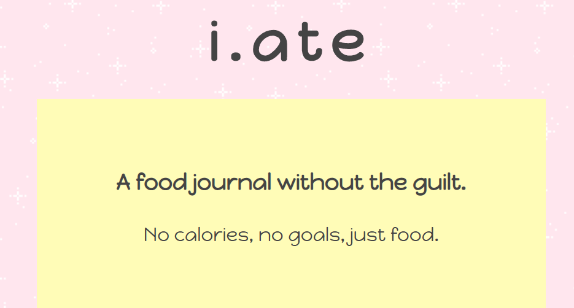
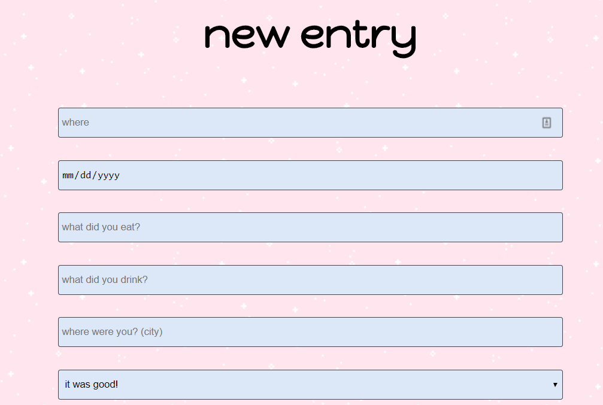
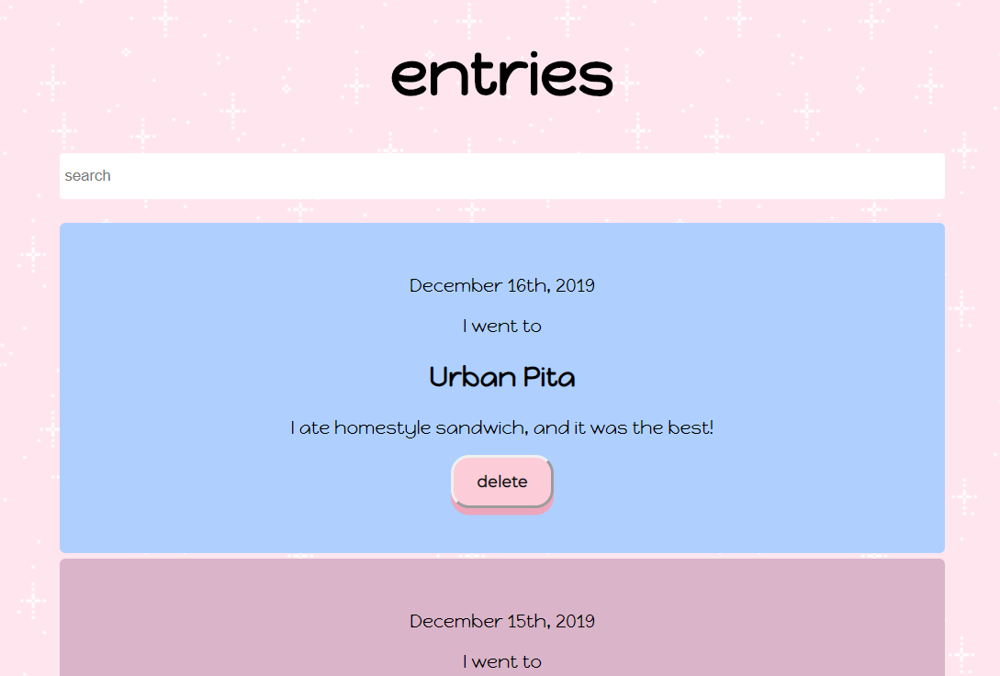

# i.ate

A food journal app to record meals eaten out.

## Motivation

I wanted to be able to keep track of restaurants that I had eaten at and what I ate.

## Screenshots

i.ate is a cute and easy to understand app to make record of where and what you ate.

Easily add meals with as many or as little details as you'd like.

Scroll through or search for your previous meals.

## Technology Used

Front-end:
HTML, CSS, JavaScript, React

Back-end:
Node, Express

## Demo

[i.ate](https://i-ate.now.sh/)
